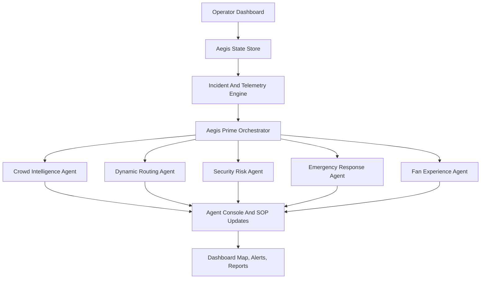
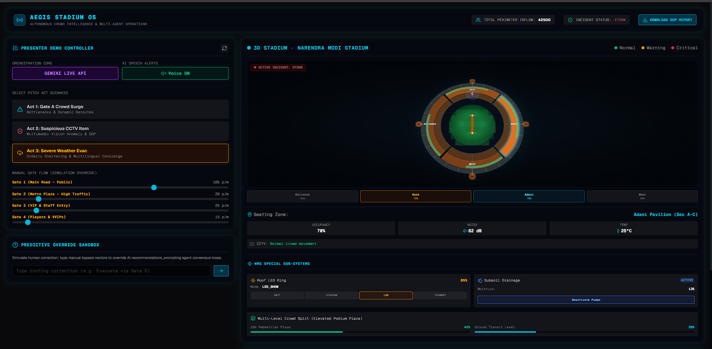
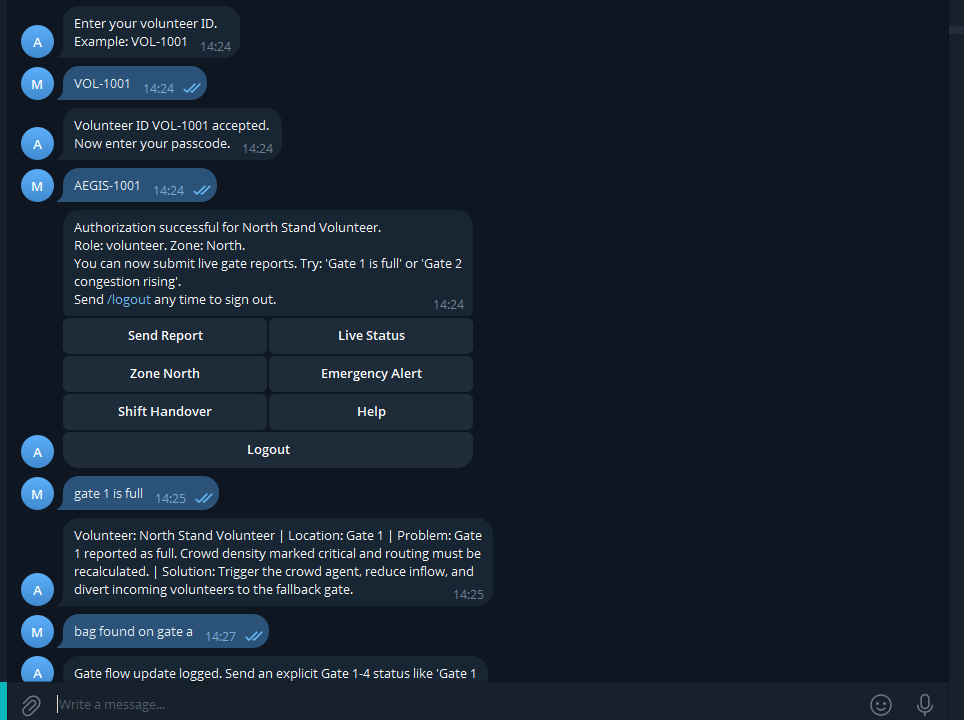

<div align="center">

# AEGIS Stadium OS

### AI-powered stadium command center for crowd safety, incident response, volunteer coordination, and fan communication.

[](https://nextjs.org/)
[](https://react.dev/)
[](https://www.typescriptlang.org/)
[](https://firebase.google.com/)
[](https://cloud.google.com/run)

</div>

AEGIS Stadium OS is a full-stack stadium operations simulator built for Narendra Modi Stadium, Ahmedabad. It acts like a live control room where operators can monitor crowd flow, trigger incident scenarios, coordinate specialist AI agents, receive volunteer reports through Telegram, simulate fan ticket events, generate SOPs, and deploy the whole system to Google Cloud Run.

The project works in two modes:

- **Demo mode:** runs locally with deterministic simulated AI responses and seeded volunteer data.
- **Live integration mode:** connects Gemini, Telegram, Firebase, Docker, Artifact Registry, and Cloud Run through environment variables.

## Table Of Contents

- [Product Snapshot](#product-snapshot)
- [App Flow](#app-flow)
- [Demo Walkthrough](#demo-walkthrough)
- [Screenshots](#screenshots)
- [Features](#features)
- [Architecture](#architecture)
- [Agent System](#agent-system)
- [Telegram Volunteer Flow](#telegram-volunteer-flow)
- [Fan Companion Flow](#fan-companion-flow)
- [Sync Flow](#sync-flow)
- [Tech Stack](#tech-stack)
- [Project Structure](#project-structure)
- [Getting Started](#getting-started)
- [Environment Variables](#environment-variables)
- [Firebase Setup](#firebase-setup)
- [Telegram Setup](#telegram-setup)
- [Docker](#docker)
- [Google Cloud Run Deployment](#google-cloud-run-deployment)
- [Useful API Routes](#useful-api-routes)
- [Verification Checklist](#verification-checklist)
- [Troubleshooting](#troubleshooting)
- [Current Limitations](#current-limitations)

## Product Snapshot

| Area | Description |
| --- | --- |
| Product | Stadium operations command center simulator |
| Stadium model | Narendra Modi Stadium, Ahmedabad |
| Primary user | Stadium control room operator |
| Secondary users | Volunteers, security teams, fan-support teams |
| Main interface | Real-time Next.js dashboard |
| External channels | Telegram bot, fan companion route |
| AI layer | Orchestrator and specialist agents |
| Deployment target | Google Cloud Run |

AEGIS is designed for hackathons, product demos, and prototype validation. It is not just a static dashboard: the UI, sync queue, agent logs, incident state, SOP state, fan route, and Telegram reports all interact during the demo.

## App Flow



External input flow:

```mermaid
flowchart LR
    A[Fan Companion] --> C[/api/sync]
    B[Telegram Volunteer Bot] --> D[/api/telegram/webhook]
    D --> E[Auth, Media Analysis, Report Classification]
    E --> C
    C --> F[Dashboard Polling]
    F --> G[Gate Flow, Stand Occupancy, Agent Logs]
```

## Demo Walkthrough

Use this path for a clean presentation:

1. Run `npm run dev`.
2. Open `http://localhost:3002`.
3. Show the command dashboard, stadium map, agent network, and live console.
4. Trigger **Act 1: Gate A Crowd Surge**.
5. Explain how AEGIS detects crowd pressure and recommends dynamic rerouting.
6. Trigger **Act 2: Suspicious CCTV Item**.
7. Approve the SOP from the human-in-the-loop panel.
8. Download the generated SOP report from the dashboard header.
9. Trigger **Act 3: Severe Weather Evac**.
10. Open `http://localhost:3002/fan` in another tab to show fan-facing alerts.
11. Send a Telegram volunteer report such as `Gate 2 congestion rising`.
12. Watch the dashboard receive the report through `/api/sync`.

Built-in scenarios:

| Scenario | What It Demonstrates |
| --- | --- |
| Act 1: Gate A Crowd Surge | Crowd bottleneck detection, gate pressure, route changes |
| Act 2: Suspicious CCTV Item | Security escalation, SOP approval, operator control |
| Act 3: Severe Weather Evac | Emergency response, shelter routing, fan communication |

## Screenshots

### Command Dashboard

The main control room shows the presenter scenario controls, live incident status, stadium map, gate-flow overrides, telemetry panels, and SOP download action.



### Telegram Volunteer Bot

The Telegram flow authenticates a field volunteer, exposes quick actions, and pushes gate reports back into the stadium operations dashboard.



More useful screenshots to add later:

| Screenshot | Suggested file | What to capture |
| --- | --- | --- |
| SOP approval | `img/sop-approval.png` | Act 2 with the human approval panel visible |
| Fan companion | `img/fan-companion.png` | `/fan` mobile companion route |
| Cloud Run | `img/cloud-run.png` | Successful deployed Cloud Run service URL |

## Features

- Real-time stadium command dashboard.
- Narendra Modi Stadium-inspired gate, stand, and bowl telemetry.
- Manual gate-flow controls for live simulation.
- Three pitch-ready incident scenarios.
- Human-in-the-loop SOP approval for high-risk actions.
- Downloadable SOP report generation.
- Multi-agent reasoning and event logs.
- Fan companion route for ticket and alert simulation.
- Telegram volunteer bot with ID/passcode authentication.
- Telegram inline menu, status, zone, report, handover, and logout flows.
- Telegram photo and voice processing hooks with Gemini.
- Firebase Admin support for volunteer records and Auth profile sync.
- Local fallback volunteer database for offline demos.
- Docker image for production.
- Cloud Build, Artifact Registry, and Cloud Run deployment path.

## Architecture

AEGIS is organized around one central simulation state and several event sources.

| Layer | Responsibility | Key Files |
| --- | --- | --- |
| UI | Dashboard, map, fan app, agent console, controls | `src/app/page.tsx`, `src/components/*` |
| State | Gates, stands, incidents, SOPs, notifications, telemetry | `src/lib/store/stateStore.ts` |
| Agents | Incident triage and specialist reasoning | `src/lib/agents/*` |
| APIs | Agent endpoints, sync queue, Telegram routes | `src/app/api/*` |
| Telegram | Auth, commands, menus, report classification | `src/lib/telegram/*` |
| Firebase | Admin SDK, Firestore, Auth profile sync | `src/lib/firebase/admin.ts` |
| Deployment | Docker, Cloud Build, Cloud Run script | `Dockerfile`, `cloudbuild.yaml`, `deploy-gcp.ps1` |

## Agent System

The agent layer is built around Aegis Prime, an orchestrator that classifies raw events and dispatches specialist agents.

| Agent | Responsibility |
| --- | --- |
| Aegis Prime / Orchestrator | Classifies incidents and selects the right specialist |
| Crowd Intelligence | Evaluates congestion, flow, density, and crowd risk |
| Dynamic Routing | Recommends safe gate and movement paths |
| Security Risk | Handles suspicious item and security escalation flows |
| Emergency Response | Handles severe weather, medical, shelter, and evacuation logic |
| Fan Experience | Creates fan-facing guidance and support responses |

The app can run without live AI keys. In simulator mode, responses are deterministic and demo-safe. With `GEMINI_API_KEY`, live Gemini-backed calls can be enabled where implemented.

## Telegram Volunteer Flow

Telegram lets field volunteers send operational reports into the dashboard.

Authentication flow:

```text
/start
  -> enter volunteer ID
  -> enter passcode
  -> authenticated volunteer menu
  -> report/status/zone/handover/emergency/logout actions
```

Seeded demo accounts:

| Volunteer ID | Passcode | Role | Zone |
| --- | --- | --- | --- |
| `VOL-1001` | `AEGIS-1001` | volunteer | North |
| `VOL-1002` | `AEGIS-1002` | volunteer | South |
| `VOL-9000` | `AEGIS-9000` | supervisor | unassigned |

Supported commands:

```text
/start                  Begin authentication
/report <details>       Submit a field report
/status                 Show current session
/zone <A|B|C|D>          Assign active sector
/handover <notes>       Submit handover notes
/logout                 End the session
```

Example reports:

```text
Gate 1 is full
Gate 2 congestion rising
Unattended bag near Adani Pavilion
Queue blocked near entry ramp
```

The project also notes this live bot:

```text
@apl_finale_bot
```

## Fan Companion Flow

The fan companion runs at:

```text
/fan
```

It is a mobile-style companion view for ticket and alert experiences. It demonstrates how fan-facing updates can stay connected to the central command dashboard.

Typical demo use:

1. Open the main dashboard in one tab.
2. Open `/fan` in another tab.
3. Trigger a dashboard incident.
4. Show how the fan-facing route reflects operational state and alerts.

## Sync Flow

`/api/sync` is the bridge between the dashboard, fan route, and Telegram events.

How it works:

- The dashboard posts the current active incident to `/api/sync`.
- Telegram and fan events are queued server-side.
- The dashboard polls `/api/sync?clear=true` every 1.5 seconds.
- Returned events become gate updates, stand updates, and agent console logs.

Important: current sync queues are in memory. They are perfect for a demo, but they reset when the server restarts.

## Tech Stack

| Category | Technology |
| --- | --- |
| Framework | Next.js 16 App Router |
| UI | React 19 |
| Language | TypeScript |
| Styling | Tailwind CSS 4 |
| Icons | Lucide React |
| AI | Google Gemini / GenAI SDK |
| Backend services | Next.js route handlers |
| Auth/data integration | Firebase Admin SDK |
| Bot channel | Telegram Bot API |
| Container | Docker |
| Cloud | Google Cloud Run, Cloud Build, Artifact Registry |

## Project Structure

```text
src/app/                         Next.js pages and API routes
src/app/page.tsx                  Main command dashboard
src/app/fan/page.tsx              Fan companion route
src/app/api/agent/*              Agent API endpoints
src/app/api/sync/route.ts        Shared sync queue
src/app/api/telegram/*           Telegram receive/send/webhook routes
src/components/                  Dashboard, map, fan, bot, and console UI
src/lib/agents/                  Specialist agent implementations
src/lib/firebase/admin.ts        Firebase Admin setup
src/lib/store/stateStore.ts      Central simulation state store
src/lib/telegram/                Telegram auth, commands, and volunteer data
scripts/set-webhook.js           Telegram webhook registration helper
Dockerfile                       Production container image
cloudbuild.yaml                  Cloud Build image build/push config
deploy-gcp.ps1                   PowerShell Cloud Run deploy helper
```

## Getting Started

Install dependencies:

```bash
npm install
```

Run the local development server:

```bash
npm run dev
```

Open:

```text
http://localhost:3002
```

Useful routes:

| Route | Screen |
| --- | --- |
| `/` | Main command dashboard |
| `/fan` | Fan companion |
| `/api/sync` | Sync queue API |
| `/api/telegram/webhook` | Telegram webhook |

## Scripts

```bash
npm run dev      # Start local dev server on port 3002
npm run build    # Build production app
npm run start    # Start production server on port 3002
npm run lint     # Run ESLint
```

## Environment Variables

Create `.env` in the project root for live integrations.

```bash
GEMINI_API_KEY=your_gemini_api_key
NEXT_PUBLIC_GEMINI_API_KEY=your_gemini_api_key

TELEGRAM_BOT_TOKEN=your_telegram_bot_token

FIREBASE_PROJECT_ID=your_firebase_project_id
FIREBASE_VOLUNTEERS_COLLECTION=volunteers
FIREBASE_SERVICE_ACCOUNT_JSON={"type":"service_account",...}

TELEGRAM_VOLUNTEER_DB_JSON=[{"volunteerId":"VOL-1001","passcode":"AEGIS-1001","displayName":"North Stand Volunteer","role":"volunteer","zone":"North","active":true}]
```

| Variable | Required | Purpose |
| --- | --- | --- |
| `GEMINI_API_KEY` | Optional | Enables live Gemini agent/media processing |
| `NEXT_PUBLIC_GEMINI_API_KEY` | Optional | Client-visible Gemini key if needed by UI features |
| `TELEGRAM_BOT_TOKEN` | Optional | Allows Telegram webhook replies |
| `FIREBASE_PROJECT_ID` | Optional | Firebase project for Admin SDK |
| `FIREBASE_VOLUNTEERS_COLLECTION` | Optional | Firestore collection name, default `volunteers` |
| `FIREBASE_SERVICE_ACCOUNT_JSON` | Optional | Local service account credentials |
| `TELEGRAM_VOLUNTEER_DB_JSON` | Optional | Overrides local fallback volunteer records |

## Firebase Setup

Firebase is optional. If it is missing, the app uses seeded volunteer records.

To enable Firebase:

1. Create or select a Firebase/GCP project.
2. Enable Firestore.
3. Create a collection named `volunteers`, or set `FIREBASE_VOLUNTEERS_COLLECTION`.
4. Add documents keyed by volunteer ID or with a `volunteerId` field.
5. Give the Cloud Run service account permission to read Firestore.
6. Give the service account permission to manage Firebase Auth users if you want Auth profile sync.

Example volunteer document:

```json
{
  "volunteerId": "VOL-1001",
  "passcode": "AEGIS-1001",
  "displayName": "North Stand Volunteer",
  "role": "volunteer",
  "zone": "North",
  "active": true
}
```

## Telegram Setup

For local testing, expose port `3002` through a public HTTPS tunnel such as ngrok or cloudflared.

Register the webhook:

```bash
node scripts/set-webhook.js https://your-public-url.example.com
```

The script registers:

```text
https://your-public-url.example.com/api/telegram/webhook
```

After deploying to Cloud Run, run the same command with your Cloud Run service URL.

## Docker

Build and run locally:

```bash
docker build -t aegis-stadium-os .
docker run --rm -p 3002:3000 --env-file .env aegis-stadium-os
```

Open:

```text
http://localhost:3002
```

The container listens on port `3000` locally. Cloud Run injects its own `PORT` value at runtime.

## Google Cloud Run Deployment

Enable required Google Cloud APIs:

```bash
gcloud services enable cloudbuild.googleapis.com run.googleapis.com artifactregistry.googleapis.com
```

Deploy from PowerShell:

```powershell
.\deploy-gcp.ps1 -ProjectId your-gcp-project-id -Region us-central1
```

The deploy script:

- Creates the Artifact Registry Docker repository if it does not exist.
- Runs Cloud Build using `cloudbuild.yaml`.
- Pushes the Docker image to Artifact Registry.
- Deploys the image to Cloud Run.
- Passes `TELEGRAM_BOT_TOKEN`, `GEMINI_API_KEY`, and `FIREBASE_PROJECT_ID` if they exist in your shell environment.

Manual deploy example:

```bash
gcloud run deploy aegis-stadium-os \
  --project your-gcp-project-id \
  --region us-central1 \
  --image us-central1-docker.pkg.dev/your-gcp-project-id/aegis-stadium-os/aegis-stadium-os:latest \
  --platform managed \
  --allow-unauthenticated \
  --set-env-vars TELEGRAM_BOT_TOKEN=your_token,GEMINI_API_KEY=your_key,FIREBASE_PROJECT_ID=your_project
```

After deploy, update the Telegram webhook:

```bash
node scripts/set-webhook.js https://your-cloud-run-url.a.run.app
```

## Useful API Routes

| Route | Purpose |
| --- | --- |
| `/api/agent/triage` | Classifies a raw incident and chooses a specialist agent |
| `/api/agent/security` | Security incident response |
| `/api/agent/emergency` | Emergency response output |
| `/api/agent/volunteer` | Volunteer-style operational response |
| `/api/incident` | Incident simulation endpoint |
| `/api/sync` | Shared queue between dashboard, fan app, and Telegram |
| `/api/telegram/webhook` | Telegram production webhook |
| `/api/telegram/receive` | Telegram/manual receive endpoint |
| `/api/telegram/send` | Telegram send helper endpoint |

## Verification Checklist

Before deployment:

```bash
npm run lint
npm run build
```

Manual checks:

- Dashboard opens at `http://localhost:3002`.
- Act 1, Act 2, and Act 3 update the map and agent console.
- SOP approval appears during the suspicious item scenario.
- SOP report downloads from the dashboard header.
- `/fan` opens and can show fan-side state.
- Telegram webhook is registered after deployment.
- Authenticated Telegram reports appear in the dashboard.
- Cloud Run service URL opens the dashboard.

## Troubleshooting

| Problem | Likely Cause | Fix |
| --- | --- | --- |
| Cloud Build cannot find `Dockerfile` | `.gcloudignore` excluded required files | Make sure `Dockerfile`, `cloudbuild.yaml`, and `.dockerignore` are uploaded |
| Artifact Registry push fails | Repository does not exist | Run `deploy-gcp.ps1`, or create the repository manually |
| Cloud Run starts but Telegram does not reply | Missing `TELEGRAM_BOT_TOKEN` or webhook not set | Set env var and run `scripts/set-webhook.js` with the deployed URL |
| Telegram media analysis fails | Missing `GEMINI_API_KEY` | Add Gemini key to Cloud Run env vars |
| Firebase volunteers are not found | Firebase env or Firestore collection missing | Check `FIREBASE_PROJECT_ID`, credentials, permissions, and collection name |
| Dashboard loses Telegram sessions after restart | Sessions are stored in memory | Move session/queue state to Firestore or another persistent store for production |
| Local Docker opens on wrong port | Container uses internal port `3000` | Run `docker run -p 3002:3000 ...` |

## Current Limitations

- This is a simulator/prototype, not a certified safety-critical system.
- Sync queues and Telegram sessions are in memory.
- Live AI features require valid Gemini credentials.
- Telegram media analysis requires Telegram and Gemini keys.
- Firebase is optional and falls back to local records when unavailable.
- For production, move transient queue/session state into a durable store.

## Roadmap Ideas

- Persist sync events and Telegram sessions in Firestore.
- Add WebSocket or Server-Sent Events instead of polling.
- Add role-based dashboard login.
- Add real weather and transit data feeds.
- Add QR-code ticket generation and scanning.
- Add automated incident timeline export.
- Add screenshot gallery and architecture images to this README.
